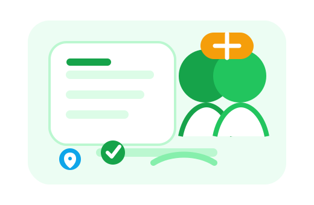

# 🛒 OrtakSepet — Akıllı Ortak Alışveriş ve Kargo Takip Platformu

OrtakSepet, kullanıcıların arkadaşları veya komşularıyla ortak alışveriş sepetleri oluşturarak kargo ve ürün maliyetlerini paylaşmalarını sağlayan, gelişmiş fiyat karşılaştırma/alarm robotları ve Gmail kargo entegrasyonu barındıran tam yığın (full-stack) bir web uygulamasıdır.

<div align="center">
  
</div>

---

## 🚀 Öne Çıkan Özellikler

*   👥 **İmece Grupları (Ortak Sepetler):** Lokasyon bazlı gruplar kurun veya mevcut gruplara katılın. Grup üyeleriyle gerçek zamanlı mesajlaşın, ortak sepete ürün ekleyin ve liderin belirlediği IBAN üzerinden ödemeleri kolayca takip edin.
*   🔍 **Gelişmiş Fiyat Karşılaştırma & Alarm:** Vatan, Amazon vb. e-ticaret sitelerinden canlı veri çekerek (Jsoup ve Playwright kullanarak) ürün fiyatlarını karşılaştırın. Hedeflediğiniz fiyat düştüğünde bildirim alın.
*   📬 **Otomatik Gmail Kargo Takibi:** Google OAuth2 entegrasyonu sayesinde gelen kutunuz otomatik olarak taranır, kargo onay mailleri tespit edilerek kargo takip durumlarınız sisteme canlı işlenir.
*   📦 **Stok ve Kritik Eşik Yönetimi:** Elinizdeki ürünlerin stok seviyelerini takip edin. Kritik eşiğin altına düşen ürünler için otomatik uyarılar alın.
*   🛡️ **Admin Kontrol Paneli:** Kullanıcı yetkilendirmeleri, destek talepleri, sistem logları ve arka planda çalışan web kazıyıcı (scraper) servislerin durumunu anlık olarak denetleyin.

---

## 🎨 Görseller & İllüstrasyonlar

### Kontrol Paneli (Dashboard)
Kontrol panelinde aktif siparişleriniz, fiyat alarmlarınız, kritik stoklarınız ve yaklaşan kargolarınız özetlenir.
<div align="center">
  
</div>

### Alarmlar ve Grup Yönetimi
Fiyatı takip edilen ürünler ve imece usulü ortaklaşa oluşturulan alışveriş grupları.
<div align="center">
  
  &nbsp;&nbsp;&nbsp;&nbsp;&nbsp;&nbsp;&nbsp;&nbsp;
  
</div>

---

## 🛠️ Kullanılan Teknolojiler

### Backend
*   **Dil ve Framework:** Java 17, Spring Boot 4.0.6 (Spring WebMVC, WebFlux, Spring Security)
*   **Kimlik Doğrulama:** Spring Security, OAuth2 Client
*   **Web Scraper / Kazıyıcılar:** Microsoft Playwright 1.44.0, Jsoup 1.17.2
*   **E-Posta Entegrasyonu:** Google API Client, Gmail API (v1-rev20220404)
*   **Veritabanı ve ORM:** PostgreSQL, Spring Data JPA, Hibernate
*   **Yardımcı Araç:** Lombok

### Frontend
*   **Kütüphane:** React (Create React App)
*   **Tasarım & Stil:** Vanilla CSS (Özel HSL renk paletleri, Dark Mode ve premium mikro-animasyonlar)
*   **İkonlar:** Lucide React
*   **İletişim:** Axios

---

## 💻 Kurulum ve Başlangıç

### Prerequisities (Gereksinimler)
*   Java 17 veya üzeri
*   Node.js ve npm
*   PostgreSQL veritabanı

### 1. Backend Kurulumu

1. `backend/src/main/resources` klasörüne gidin.
2. `application-local.properties.example` dosyasının bir kopyasını oluşturup adını `application-local.properties` yapın:
   ```bash
   cp backend/src/main/resources/application-local.properties.example backend/src/main/resources/application-local.properties
   ```
3. `application-local.properties` dosyasının içini kendi veritabanı şifreniz ve Google OAuth (Gmail) API kimlik bilgilerinizle doldurun:
   ```properties
   spring.datasource.password=LOKAL_POSTGRES_SIFRENIZ
   spring.security.oauth2.client.registration.google.client-id=GOOGLE_CLIENT_ID
   spring.security.oauth2.client.registration.google.client-secret=GOOGLE_CLIENT_SECRET
   ```
4. Backend projesini ayağa kaldırın:
   ```bash
   cd backend
   ./mvnw spring-boot:run
   ```

### 2. Frontend Kurulumu

1. Frontend klasörüne gidin:
   ```bash
   cd frontend
   ```
2. Bağımlılıkları yükleyin:
   ```bash
   npm install
   ```
3. Uygulamayı başlatın:
   ```bash
   npm start
   ```
   *Uygulama varsayılan olarak tarayıcınızda `http://localhost:3000` adresinde açılacaktır.*

---

## 📸 Uygulama Ekran Görüntüleri

<table align="center">
  <tr>
    <td align="center"><br/><b>Giriş / Kayıt Ekranı</b></td>
    <td align="center"><br/><b>Ana Sayfa / Dashboard</b></td>
    <td align="center"><br/><b>İmece Grupları</b></td>
  </tr>
  <tr>
    <td align="center"><br/><b>Grup Detayı</b></td>
    <td align="center"><br/><b>Grup Sohbeti & Alışveriş Listesi</b></td>
    <td align="center"><br/><b>Fiyat Karşılaştırma & Arama</b></td>
  </tr>
  <tr>
    <td align="center"><br/><b>Fiyat Alarmları</b></td>
    <td align="center"><br/><b>Kargo Takibi</b></td>
    <td align="center"><br/><b>Stok Takibi & Yönetimi</b></td>
  </tr>
</table>

---

## 📝 Lisans

Bu proje eğitim ve kişisel gelişim amacıyla geliştirilmiştir. Ticari amaçla kullanımı önerilmez.
